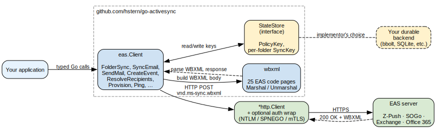

# go-activesync

[](https://github.com/hstern/go-activesync/actions/workflows/ci.yml)
[](https://codecov.io/gh/hstern/go-activesync)
[](https://pkg.go.dev/github.com/hstern/go-activesync)
[](https://goreportcard.com/report/github.com/hstern/go-activesync)
[](LICENSE)

A Go implementation of **Microsoft Exchange ActiveSync (EAS)** — the
mobile-mail sync protocol Outlook for iOS / the iPhone Mail app / etc.
speak. Built and tested against [Z-Push](https://github.com/Z-Hub/Z-Push)
and [SOGo](https://www.sogo.nu/), and protocol-compatible with anything
that follows MS-ASCMD (including on-prem Exchange and Office 365).

The full protocol surface — every command in MS-ASCMD across protocol
versions 12.0 / 12.1 / 14.0 / 14.1 / 16.0 / 16.1 — is implemented:
folder hierarchy, mail (read + send + reply + forward + move + flag +
delete), calendar (with recurrence + exceptions + the binary
`TimeZone` blob), contacts, tasks, notes, GAL search, OOF, S/MIME,
push notifications via Ping, the works. Stdlib + one third-party
dependency ([`smallstep/pkcs7`](https://github.com/smallstep/pkcs7) for
S/MIME).



## Install

```sh
go get github.com/hstern/go-activesync/eas
```

## Quick start

```go
import (
    "context"
    "github.com/hstern/go-activesync/eas"
)

c, err := eas.NewClient(eas.Config{
    ServerURL: "https://mail.example.com/Microsoft-Server-ActiveSync",
    Username:  "henry",
    Password:  pw,                 // already pulled from your secret store
    DeviceID:  "32hexcharsofdeviceidhere00000000",
    State:     eas.NewMemoryState(),
})
if err != nil { return err }

ctx := context.Background()
_, _ = c.NegotiateVersion(ctx)     // pick the highest version both sides speak
if err := c.Provision(ctx); err != nil { return err }

folders, _ := c.FolderSync(ctx)
for _, f := range folders.Added {
    fmt.Println(f.Type, f.DisplayName, f.ServerID)
}
```

For the full API tour with diagrams (Provision handshake, Sync state
machine, auth-scheme decision tree) and worked examples (S/MIME,
calendar recurrence, structured search) see **[`eas/README.md`](eas/README.md)**.

## Packages

| Package | Purpose | Deep dive |
|---------|---------|-----------|
| [`eas`](eas/) | EAS client: every MS-ASCMD command, all major auth schemes, durable state | [eas/README.md](eas/README.md) |
| [`wbxml`](wbxml/) | WAP Binary XML codec, all 25 EAS code pages | [wbxml/README.md](wbxml/README.md) |

The `eas` package is what you use; `wbxml` is the wire-format layer it's
built on, exported in case you need to debug a frame, register a custom
code page, or build a non-EAS WBXML client.

## What's implemented

**Commands.** `Sync`, `SendMail`, `SmartReply`, `SmartForward`,
`MoveItems`, `FolderSync`/`Create`/`Update`/`Delete`,
`GetItemEstimate`, `MeetingResponse`, `Search`, `Find` (16.x),
`ResolveRecipients`, `ValidateCert`, `ItemOperations` (Fetch, Move,
EmptyFolderContents, DocumentLibrary, FetchAttachment), `Settings`
(DeviceInformation, OOF Get/Set, UserInformation,
RightsManagementInformation, DevicePassword), `Ping`, `Provision` (with
RemoteWipe acknowledgement), `Autodiscover` (HTTPS POST → HTTP redirect
fallback → SRV lookup).

**Authentication.** HTTP Basic, OAuth Bearer (with `RetryOn401`
token-refresh hook), NTLM (via `Azure/go-ntlmssp`), Negotiate / SPNEGO
(Kerberos via `jcmturner/gokrb5/v8`), and mTLS client certificates
(consumer-side, via `*tls.Config`).

**Protocol smoothings.** Protocol-version negotiation, transparent 449
re-Provision retry (MS-ASPROV §3.1.5.2), `Status=3 InvalidSyncKey`
reset-and-retry, gzip request/response transport, base64 URL encoding
(MS-ASHTTP §2.2.1.1.2), Sync long-polling via `Wait` /
`HeartbeatInterval`.

**Higher-level helpers.** Calendar recurrence + exceptions, EAS binary
`TimeZone` blob round-trip, structured Search/Find query AST
(`And`/`Or`/`EqualTo`/`GreaterThan`/`LessThan`), full Provision policy
parsing, S/MIME signing + encryption.

## Testing

```sh
go test ./...
```

Pure-Go, no fixtures needed, runs in seconds.

For end-to-end testing against a real EAS server, the `eas` package
ships an integration suite gated on the `integration` build tag:

```sh
EAS_INTEGRATION_URL=https://your.server/Microsoft-Server-ActiveSync \
EAS_INTEGRATION_USER=you \
EAS_INTEGRATION_PASS=… \
go test -tags integration -v ./eas
```

A self-contained Z-Push test target lives in [`testenv/`](testenv/)
(Docker; one container with Z-Push 2.7.6 + Dovecot + Postfix +
Radicale, exercising email + calendar + contacts). One command stands
it up:

```sh
cd testenv && make up && make test && make down
```

See [`testenv/README.md`](testenv/README.md) for the stack details and
how to extend it.

## CI

Every push runs lint (`gofmt`, `go vet`, `go mod tidy` cleanliness,
`govulncheck`) and unit tests under the race detector with coverage.
Pull requests + `main` pushes also bring up the Docker testenv and run
the integration suite end-to-end. Total: about 3 minutes.
See [`.github/workflows/ci.yml`](.github/workflows/ci.yml).

## Used by

If you're building on top of this library and want to be listed, open
a PR adding yourself.

## Contributing

PRs welcome — see [CONTRIBUTING.md](CONTRIBUTING.md) for setup, coding
standards, and how to add a new EAS command. Bug reports use the
[issue templates](.github/ISSUE_TEMPLATE/); security disclosures are
private — see [SECURITY.md](SECURITY.md). Project participants agree
to the [Code of Conduct](CODE_OF_CONDUCT.md).

## License

MIT — see [LICENSE](LICENSE).
