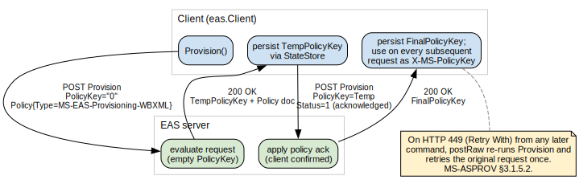
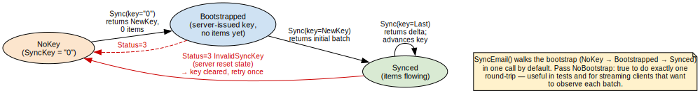
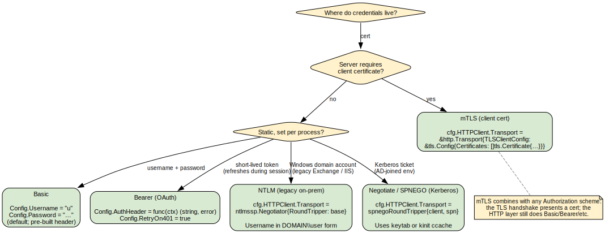

# eas — Exchange ActiveSync 14.x client

[](https://pkg.go.dev/github.com/hstern/go-activesync/eas)

A complete EAS (Microsoft Exchange ActiveSync) client implementation in Go.
Targets protocol versions 12.0 / 12.1 / 14.0 / 14.1 / 16.0 / 16.1; tested
against Z-Push and SOGo. Stdlib + one third-party dep
([`smallstep/pkcs7`](https://github.com/smallstep/pkcs7) for S/MIME).

For the broader project view (testenv, CI, contribution guide) see the
[repo root README](../README.md). This page is the API tour.

## Install

```sh
go get github.com/hstern/go-activesync/eas
```

## Quick start

```go
import (
    "context"
    "github.com/hstern/go-activesync/eas"
)

c, err := eas.NewClient(eas.Config{
    ServerURL: "https://mail.example.com/Microsoft-Server-ActiveSync",
    Username:  "henry",
    Password:  pw,                          // already pulled from your secret store
    DeviceID:  "32hexcharsofdeviceidhere00000000",
    State:     eas.NewMemoryState(),        // or your durable StateStore
})
if err != nil { return err }

ctx := context.Background()
_, _ = c.NegotiateVersion(ctx)              // pick the highest version both sides speak
if err := c.Provision(ctx); err != nil { return err }

folders, err := c.FolderSync(ctx)
for _, f := range folders.Added {
    fmt.Println(f.Type, f.DisplayName, f.ServerID)
}
```

## The Provision handshake

Most EAS servers refuse every other command until the client has completed
a two-phase Provision exchange and is sending `X-MS-PolicyKey` on every
subsequent request. `Client.Provision` does both phases and persists the
final key via your `StateStore`. On HTTP 449 from any later command,
`postRaw` re-runs the whole dance and retries the original request once
(MS-ASPROV §3.1.5.2) — you don't need to handle it manually.



## Sync state per folder

EAS Sync is per-folder and stateful. The first call to `Sync` on any new
folder must use `SyncKey="0"` and is mandated by the spec to return zero
items — only a fresh key. The second call returns the initial batch;
subsequent calls return deltas. `Client.SyncEmail` walks that bootstrap
transparently in one call. Pass `EmailSyncOptions{NoBootstrap: true}` if
you want to observe each step (used in the test suite).



State lives behind the `StateStore` interface. A concurrent-safe
in-memory implementation (`NewMemoryState()`) ships for tests and
one-shot CLIs; for production, plug in your own (bbolt, SQLite, Redis
— anything with `Get`/`Set` semantics is a small adapter).

## Command catalog

| Class | Symbols |
|-------|---------|
| **Folders** | `FolderSync`, `FolderCreate`, `FolderUpdate`, `FolderDelete` |
| **Email** | `SyncEmail`, `FetchEmail`, `FetchAttachment`, `SendMail`, `SmartReply`, `SmartForward`, `MoveItems`, `MoveViaItemOperations`, `ApplyEmailChanges`, `SearchEmail`, `SearchEmailQuery`, `FindEmail`, `EmptyFolderContents` |
| **Calendar** | `SyncCalendar`, `CreateEvent`, `UpdateEvent`, `DeleteEvent`, `RespondInvite` (+ types `Recurrence`, `Exception`, `EASTimeZone`, `EncodeTimeZone`) |
| **Contacts / Tasks / Notes** | `SyncContacts`, `SyncTasks`, `SyncNotes` + `{Create,Update,Delete}{Contact,Task,Note}` + `CompleteTask` + `GALSearch` |
| **Settings** | `SettingsDeviceInformation`, `GetOof`, `SetOof`, `GetUserInformation`, `GetRightsManagementTemplates`, `SetDevicePassword` |
| **Admin / protocol** | `Options`, `NegotiateVersion`, `Provision`, `AcknowledgeRemoteWipe`, `Ping`, `ResolveRecipients`, `ValidateCert`, `Autodiscover` |
| **Document Library** | `FetchDocumentLibrary` (legacy SharePoint-over-EAS) |

Per-symbol API docs live in [godoc](https://pkg.go.dev/github.com/hstern/go-activesync/eas).

## Authentication



| Scheme | What to set | When to use |
|--------|-------------|-------------|
| **Basic** | `Config.Username` + `Config.Password` | Default; Z-Push and SOGo |
| **Bearer** (OAuth) | `Config.AuthHeader = func(ctx) (string, error) { … }` + `Config.RetryOn401 = true` | Office 365, any token-based identity provider |
| **NTLM** | wrap `cfg.HTTPClient.Transport` with `ntlmssp.Negotiator{}`; username in `DOMAIN\user` form | Legacy on-prem Exchange / IIS |
| **Negotiate / SPNEGO** | wrap `cfg.HTTPClient.Transport` with a SPNEGO `RoundTripper` (e.g. via `gokrb5/v8`); supply keytab or use `kinit` ccache | AD-joined environments |
| **mTLS** | set `tls.Config.Certificates` on the underlying `*http.Transport` | Server demands a client cert; combines with any of the above |

`AuthHeader` is called per request, so it's the natural seam for OAuth
token refresh. Pair with `RetryOn401: true` to get a transparent retry on
token expiry.

## Autodiscover

```go
res, err := eas.Autodiscover(ctx, "user@example.com", password, eas.AutodiscoverOptions{})
// res.URL → Config.ServerURL
```

`Autodiscover` runs five candidate steps in order, matching Outlook's
flow plus a well-known fallback:

1. `POST https://<domain>/Autodiscover/Autodiscover.xml`
2. `POST https://autodiscover.<domain>/Autodiscover/Autodiscover.xml`
3. `GET http://autodiscover.<domain>/...` and follow a 302
4. SRV record `_autodiscover._tcp.<domain>` → POST to the discovered host
5. `OPTIONS https://<domain|autodiscover.<domain>|mail.<domain>>/Microsoft-Server-ActiveSync`

Step 5 is the well-known fallback. It handles deployments whose
autodiscover responder does not speak the EAS `mobilesync` request schema
(notably SOGo, which historically implements only the Outlook schema and
rejects mobilesync with HTTP 400 `<ErrorCode>601</ErrorCode>`). When the
schema-aware attempts all fail, the library probes the canonical EAS
path with HTTP OPTIONS and accepts any 2xx response carrying an
`MS-Server-ActiveSync` or `MS-ASProtocolVersions` header. The returned
`AutodiscoverResult` has `URL` and `ServerHostname` set but no
`DisplayName` (OPTIONS doesn't carry it).

Each step can be disabled via `AutodiscoverOptions.Skip*` flags. To pin a
specific endpoint and skip discovery entirely, just set
`Config.ServerURL` directly and don't call `Autodiscover` at all.

## State persistence

```go
type StateStore interface {
    PolicyKey(ctx context.Context) (string, error)
    SetPolicyKey(ctx context.Context, key string) error
    SyncKey(ctx context.Context, folderID string) (string, error)
    SetSyncKey(ctx context.Context, folderID, key string) error
}
```

Use `NewMemoryState()` for tests. For production, implement against
whatever durable store you already have — bbolt, SQLite, Redis,
your-favourite-K/V. Lose the SyncKey for a folder and you'll force a
full resync of that folder; lose the PolicyKey and the next request
will get a 449 and `postRaw` will re-Provision automatically.

## Errors and transparent retries

```go
if eas.IsHTTPStatus(err, 401) { … }    // 401, 403, etc.
if eas.IsStatusCode(err, 3) { … }      // EAS Status code (3 = InvalidSyncKey)
```

| Error type | Returned when |
|------------|---------------|
| `*HTTPError` | Server replied with non-2xx HTTP status. Includes `StatusCode`, `Status`, `URL`, first 4KiB of body. |
| `*StatusError` | Server returned a parseable WBXML body with a non-1 `Status` element. Includes `Command` and EAS status code. |

Two retries happen automatically inside `Client`:

1. **HTTP 401 + `RetryOn401` + `AuthHeader`**: refresh the bearer token
   and retry once. (OAuth flows where the token may have expired.)
2. **HTTP 449** (Retry With, Microsoft IIS extension): re-Provision and
   retry once. EAS servers expire policy keys aggressively; the spec
   mandates this recovery and we always do it.

`SyncEmail`, `SyncCalendar`, `SyncContacts`, `SyncTasks`, and `SyncNotes`
also handle `Status=3 InvalidSyncKey` by clearing the local key and
retrying once.

## Calendar recurrence + timezones

```go
loc, _ := time.LoadLocation("America/New_York")

draft := eas.EventDraft{
    Subject:   "Weekly review",
    StartTime: time.Date(2026, 6, 1, 14, 0, 0, 0, loc),
    EndTime:   time.Date(2026, 6, 1, 15, 0, 0, 0, loc),
    TimeZone:  &eas.EASTimeZone{}, // or build via helper for full DST fidelity
    Recurrence: &eas.Recurrence{
        Type:      eas.RecurrenceWeekly,
        Interval:  1,
        DayOfWeek: eas.DowMonday | eas.DowFriday,
        Until:     time.Date(2026, 12, 31, 23, 59, 59, 0, time.UTC),
    },
}
id, err := c.CreateEvent(ctx, calendarFolderID, draft)
```

Per-instance overrides go into `draft.Exceptions`. The
`EASTimeZone` blob is the standard 172-byte Microsoft TIME_ZONE_INFORMATION
struct; `EncodeTimeZone(loc)` produces a base64-ready value, and parsed
events round-trip the original blob on `EventItem.TimeZoneRaw`.

## Structured Search / Find queries

```go
import "time"

q := eas.And(
    eas.EmailClass(),
    eas.EqualTo(eas.PropEmailFrom, "alice@example.com"),
    eas.GreaterThan(eas.PropEmailDateReceived,
        time.Now().Add(-30*24*time.Hour).Format("2006-01-02T15:04:05.000Z")),
)

res, err := c.SearchEmailQuery(ctx, q, eas.EmailSearchOptions{Range: "0-49"})
```

Use `eas.SearchEmail` for the simple free-text path, and
`SearchEmailQuery` (or the 16.x-only `FindEmail`) when you need the
structured operators.

## S/MIME

```go
signed, err := eas.SignMIME(plainMIME, eas.SMIMESigner{
    Certificate: signerCert,
    PrivateKey:  signerKey,
})

encrypted, err := eas.EncryptMIME(plainMIME, []*x509.Certificate{recipientCert})

// Combined: sign then encrypt, the order most MUAs expect.
out, err := eas.SignAndEncryptMIME(plainMIME,
    eas.SMIMESigner{Certificate: signerCert, PrivateKey: signerKey},
    []*x509.Certificate{recipientCert})
```

Recipient certificates can be retrieved via `ResolveRecipients` with
`CertificateRetrieval = 2` (Full).

## Testing

Unit tests are pure-Go (`go test ./eas`). The integration suite
(`go test -tags integration ./eas`) exercises every command against a
live EAS server you point it at via env vars; see the
[`testenv/`](../testenv/) Docker stack for a one-command Z-Push setup,
and the [integration test file](integration_test.go) for runnable
examples of every major command.

### Testing your own code that depends on `eas`

`eas.Client` is an interface. The
[`easmock`](https://pkg.go.dev/github.com/hstern/go-activesync/eas/easmock)
subpackage provides hand-written test doubles — one struct per
interface, with a `*Func` field per method. Configure only the fields
your test cares about; unconfigured methods return a sentinel error
so misbehaving code paths surface loudly.

```go
import (
    "context"
    "testing"

    "github.com/hstern/go-activesync/eas"
    "github.com/hstern/go-activesync/eas/easmock"
)

func TestInboxSummary(t *testing.T) {
    var c eas.Client = &easmock.Client{
        EmailClient: easmock.EmailClient{
            SyncEmailFunc: func(_ context.Context, _ string, _ eas.EmailSyncOptions) (*eas.EmailSyncResult, error) {
                return &eas.EmailSyncResult{
                    Added: []eas.EmailItem{{Subject: "hi"}},
                }, nil
            },
        },
    }
    // ... pass c to your code under test ...
}
```

Sub-interfaces (`EmailClient`, `CalendarClient`, …) compose into the
umbrella `Client`; consumers can depend on a slim view if they only
touch one feature area.

## Server-specific notes

Interop gaps caught by testing against live deployments. The library
handles each one as gracefully as it can; the symptoms can be confusing
without the context below.

| Server | Behavior | What the library does |
|--------|----------|----------------------|
| **SOGo autodiscover** | The SOGo autodiscover module implements only the Outlook request schema, not EAS `mobilesync`. Returns HTTP 400 `<ErrorCode>601</ErrorCode>` "Not supported xmlns". | `Autodiscover` falls through to the well-known fallback (step 5) and locates the EAS endpoint via an OPTIONS probe. No caller action needed. |
| **Z-Push BackendIMAP `ResolveRecipients`** | BackendIMAP does not implement the GAL lookup hook, so every `ResolveRecipients` request comes back with EAS Status 5 (ServerError). | The library surfaces a `*StatusError` with `Command=ResolveRecipients Status=5`. There is no library-side workaround for a server that doesn't implement the verb — catch and skip. |
| **Z-Push BackendIMAP `GetUserInformation`** | Returns the primary email correctly but reports an empty `Accounts` list (no per-account detail). | `UserInformation{PrimaryEmail: …, Accounts: nil}`. Treat the empty slice as expected on Z-Push. |
| **Z-Push Ping `<Folder>` element shape** | Z-Push (correctly per MS-ASCMD §2.2.2.11.2) sends the changed folder ID as plain text content of `<Folder>`, not the nested `<Folder><Id>…</Id></Folder>` form seen elsewhere in EAS. | The parser handles both shapes. Fixed in v0.2. |

## See also

- [Repo root README](../README.md) — module-level overview, badges, license
- [`wbxml` package](../wbxml/) — the WBXML codec the client uses
- [godoc](https://pkg.go.dev/github.com/hstern/go-activesync/eas) — full API reference
