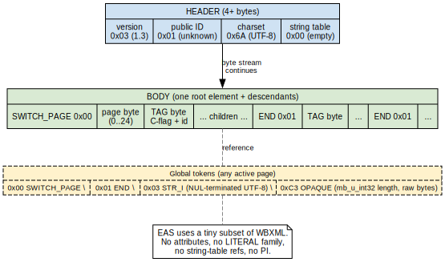
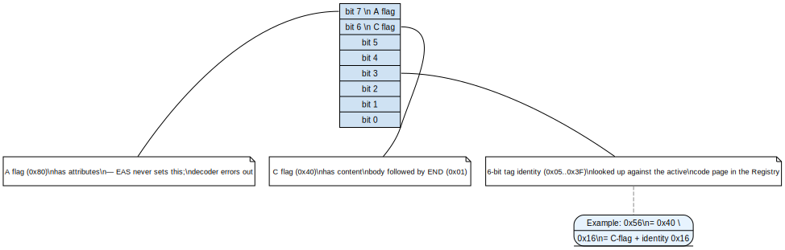

# wbxml — WAP Binary XML codec for EAS

[](https://pkg.go.dev/github.com/hstern/go-activesync/wbxml)

WBXML 1.3 encoder/decoder profiled for Microsoft Exchange ActiveSync
(MS-ASWBXML). Stdlib only; no external dependencies.

This is the wire-format layer the [`eas` package](../eas/) is built on.
Most users won't touch it directly — but if you're debugging a bad
request, adding a new EAS code page, or building a non-EAS WBXML client,
this is the entry point.

## Install

```sh
go get github.com/hstern/go-activesync/wbxml
```

## Quick start

```go
import "github.com/hstern/go-activesync/wbxml"

// Build a request body: <FolderSync><SyncKey>0</SyncKey></FolderSync>
doc := &wbxml.Document{
    Root: wbxml.E(wbxml.PageFolderHierarchy, "FolderSync",
        wbxml.E(wbxml.PageFolderHierarchy, "SyncKey", wbxml.Text("0")),
    ),
}

bytes, err := wbxml.Marshal(doc, wbxml.DefaultRegistry())
// → 0x03 0x01 0x6A 0x00  0x00 0x07  0x56  0x52 0x03 '0' 0x00 0x01  0x01

// Decode a server response back into the same tree shape.
parsed, err := wbxml.Unmarshal(bytes, wbxml.DefaultRegistry())
key := parsed.Root.Find("SyncKey").TextContent() // "0"
```

`Marshal` and `Unmarshal` round-trip byte-equal for any input the codec
can produce — verified by the test suite with hand-crafted fixtures.

## Wire format

Every WBXML document is a 4-byte header followed by a body of tag
tokens, content tokens (`STR_I` for inline text, `OPAQUE` for raw
bytes), and `END` markers terminating each element with content. A
`SWITCH_PAGE` token (0x00 + page byte) changes the active code page
mid-stream so subsequent tag bytes are looked up against the new page.



## Tag byte anatomy

A tag byte packs three things: an attribute flag (bit 7), a content
flag (bit 6), and the tag's 6-bit identity within the active code page.
Identities live in `0x05..0x3F` because `0x00..0x04` are reserved for
global tokens (SWITCH_PAGE, END, STR_I, etc.).

EAS doesn't use WBXML attributes, so the codec rejects any tag with the
A-flag set rather than silently dropping the attribute payload.



## Code pages

EAS partitions its tags into 25 numbered "code pages" — one per
namespace (AirSync, Email, Calendar, AirSyncBase, Provision, …). The
package ships them all preconfigured:

```go
r := wbxml.DefaultRegistry()
r.PageName(wbxml.PageEmail)              // "Email"
name, _ := r.TagName(wbxml.PageEmail, 0x14)   // "Subject"
id, _   := r.TagID(wbxml.PageEmail, "From")   // 0x18
```

To add a custom or extended page, build your own registry:

```go
r := wbxml.NewRegistry()
r.Add(&wbxml.Codepage{
    Number: 99,
    Name:   "MyCustom",
    Tags:   map[byte]string{0x05: "Hello", 0x06: "World"},
})
// pass r to Marshal / Unmarshal in place of DefaultRegistry()
```

| Page | Constant | Notes |
|-----:|----------|-------|
| 0  | `PageAirSync`         | Sync command framing |
| 1  | `PageContacts`        | Contact items |
| 2  | `PageEmail`           | Email items |
| 4  | `PageCalendar`        | Calendar items |
| 5  | `PageMove`            | MoveItems |
| 6  | `PageGetItemEstimate` | GetItemEstimate |
| 7  | `PageFolderHierarchy` | FolderSync / FolderCreate / etc. |
| 8  | `PageMeetingResponse` | Meeting accept/decline |
| 9  | `PageTasks`           | Task items |
| 10 | `PageResolveRecipients` | Address resolution |
| 11 | `PageValidateCert`    | S/MIME cert validation |
| 12 | `PageContacts2`       | Contact extras (NickName, IM, …) |
| 13 | `PagePing`            | Long-poll change notifications |
| 14 | `PageProvision`       | Policy negotiation |
| 15 | `PageSearch`          | Free-text + structured queries |
| 16 | `PageGAL`             | GAL search results |
| 17 | `PageAirSyncBase`     | Body / Attachments shared types |
| 18 | `PageSettings`        | OOF, DeviceInformation, … |
| 19 | `PageDocumentLibrary` | SharePoint browsing (legacy) |
| 20 | `PageItemOperations`  | Fetch / Move / Empty |
| 21 | `PageComposeMail`     | SendMail / SmartReply / SmartForward |
| 22 | `PageEmail2`          | Email extras (ConversationId, Bcc, …) |
| 23 | `PageNotes`           | Note items |
| 24 | `PageRightsManagement` | IRM templates + license |
| 25 | `PageFind`            | EAS 16.x advanced search |

## Walking parsed trees

```go
// Find: depth-first, returns the first matching element by name.
status := doc.Root.Find("Status")
if status != nil {
    code := status.TextContent()
}

// FindAll: every match in document order.
for _, add := range doc.Root.FindAll("Add") {
    serverID := add.Find("ServerId").TextContent()
}

// TextContent: concatenate inline Text children of one element.
subject := app.Find("Subject").TextContent()
```

`Find` ignores the code page and matches on tag name only — EAS tag
names are unique enough across the spec that this is safe in practice
(and far more ergonomic than matching `(page, name)` tuples). When
ambiguity bites you, walk `Element.Children` directly and type-switch.

## Building documents: `wbxml.E`

`E(page, name, children...)` is the one-liner for building element
trees, designed to read top-down like the XML it produces:

```go
wbxml.E(wbxml.PageAirSync, "Sync",
    wbxml.E(wbxml.PageAirSync, "Collections",
        wbxml.E(wbxml.PageAirSync, "Collection",
            wbxml.E(wbxml.PageAirSync, "SyncKey", wbxml.Text(key)),
            wbxml.E(wbxml.PageAirSync, "CollectionId", wbxml.Text(folderID)),
            wbxml.E(wbxml.PageAirSync, "GetChanges", wbxml.Text("1")),
            wbxml.E(wbxml.PageAirSync, "Options",
                wbxml.E(wbxml.PageAirSync, "FilterType", wbxml.Text("4")),
                wbxml.E(wbxml.PageAirSyncBase, "BodyPreference",
                    wbxml.E(wbxml.PageAirSyncBase, "Type", wbxml.Text("1")),
                    wbxml.E(wbxml.PageAirSyncBase, "TruncationSize", wbxml.Text("4096")),
                ),
            ),
        ),
    ),
)
```

The encoder emits `SWITCH_PAGE` tokens automatically at the seams
between code pages.

## Content node types

Three node types implement the `Node` interface:

| Type | What it encodes to | Used for |
|------|--------------------|----------|
| `*Element` | recursive (tag byte + children + END) | nested structure |
| `Text(s)` | `STR_I` 0x03 + UTF-8 bytes + 0x00 | inline strings (sync keys, status codes, addresses) |
| `Opaque(b)` | `OPAQUE` 0xC3 + mb_u_int32 length + raw bytes | MIME bodies, S/MIME blobs, contact pictures, certificates — anything binary or NUL-bearing |

Inline strings cannot contain NUL bytes (the encoder rejects them with
a clear error rather than producing a truncated frame the server would
silently misinterpret). Use `Opaque` for any byte sequence that might
include NULs.

## Errors

The decoder reports failures with byte offsets so fixtures can be
debugged against the wire:

```
wbxml: unknown tag 0x11 on page 0 (AirSync) at offset 5
wbxml: element with attributes (byte 0xD6) at offset 6: not supported (EAS does not use attributes)
wbxml: mb_u_int32 longer than 5 bytes at offset 12
wbxml: element "Body": str_i: unexpected EOF
```

Most errors come from a registry/wire mismatch (a server returned a tag
the registry doesn't know) or a truncated stream.

## Status

Round-trip-tested against captured Z-Push and SOGo responses. Used in
production by the [`eas` package](../eas/).

## See also

- [`eas` package](../eas/) — the EAS client built on this codec
- [Repo root README](../README.md) — module-level overview
- [godoc](https://pkg.go.dev/github.com/hstern/go-activesync/wbxml) — full API reference
- [MS-ASWBXML](https://learn.microsoft.com/en-us/openspecs/exchange_server_protocols/ms-aswbxml/3a06fb3b-7d4d-4a52-bb45-7f4f404e8c1d) — Microsoft's authoritative spec
- [WBXML 1.3 (OMA)](https://www.openmobilealliance.org/wp/Affiliates/wbxml/wbxml.html) — the underlying binary XML format
